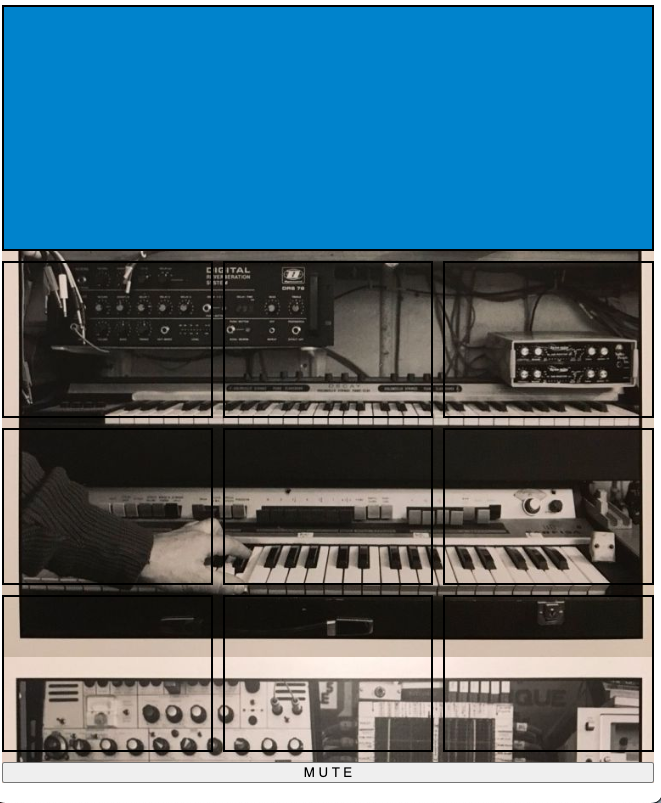
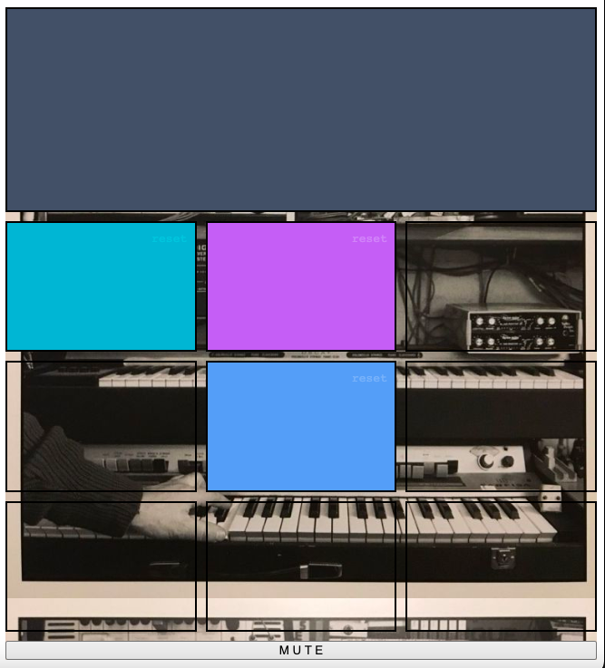
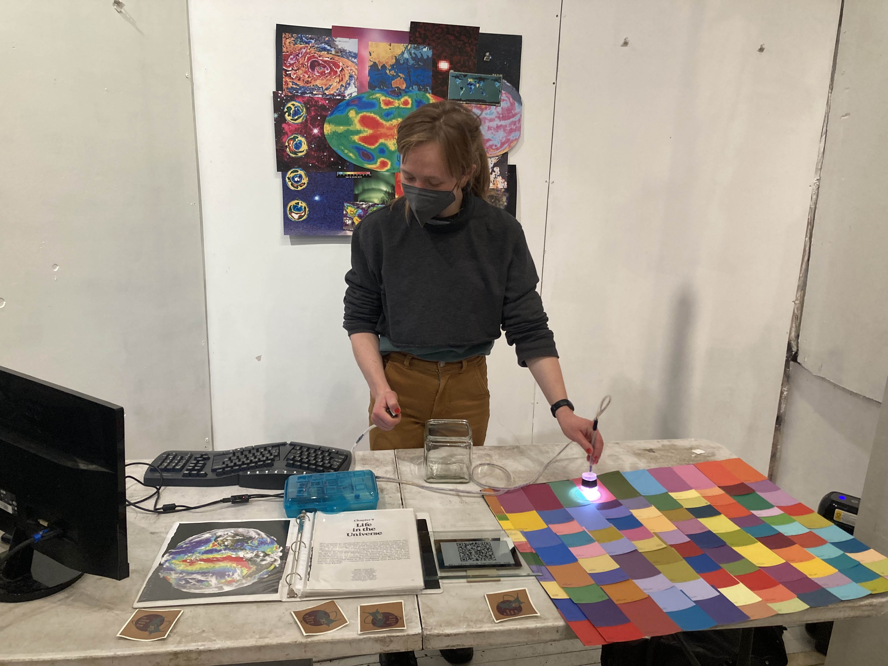
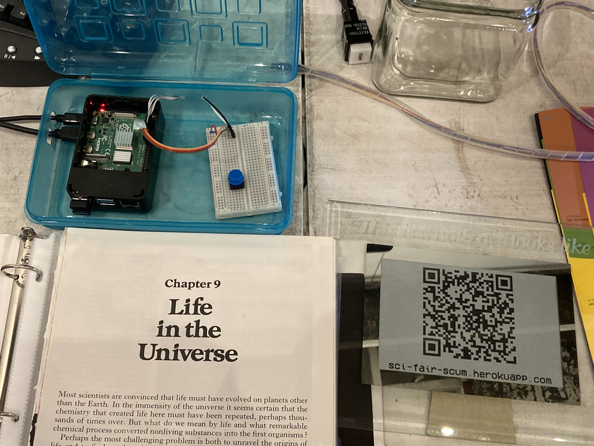
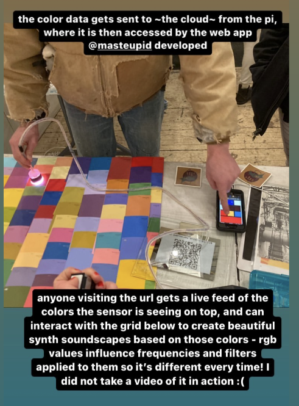
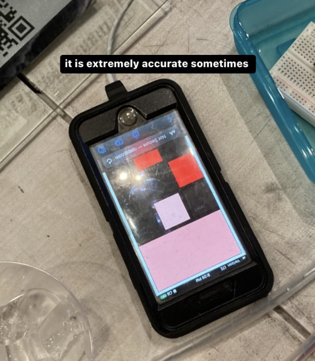

# Interactive "Light-to-Sound" Web Audio Synth
### With [Haley Ryan](https://github.com/haley-r)
### *"sci-fair-scum"*

First presentated Dec 18, 2022 @ Cyanotopia, MPLS, MN

Check out the demo [here](https://sci-fair-scum.herokuapp.com)

- Synth allows users to control three simultaneous signal chains, arranged as columns of three squares. 
- Top square in column generate sinewaves (osc and subosc) based on 'R' value of selected 'RBG' color.
- Middle squares modulate sine frequencies via an Low-Frequency Oscillator (LFO). LFO frequency and gain are set by ratios of R, G, and B values.
- Bottom squares are Low-Pass Filters (LPF); they are currently deactivated, because the signal chain is not working properly.

An Adafruit Flora Color Sensor (TCS34725) sends RBG color data to hosted node.js server via python script on RaspberryPi. Users navigate to browser app, which receives live RBG color data. Users control sound by selecting a color, which is converted into sound using an experimental web audio library [i dropped my phone the screen cracked](https://github.com/billorcutt/i_dropped_my_phone_the_screen_cracked) by developer Bill Orcutt.

This hosted demonstration runs a node.js script which randomly generates RBG values every other second, replicating the function of the Raspberry Pi controller.

No squares are selected, and no sound will play.

Two signal paths have been triggered. The middle oscillators are being modified by an LFO.

*If an LFO (middle square) is deactivated while app is running, either by clicking 'reset' on square (top right corner) or 'MUTE' at bottom, it will not restart. Refresh browser to continue modifying LFO.*

## APP IN ACTION!!! ###

Explanatory Instagram posts by Haley Ryan

